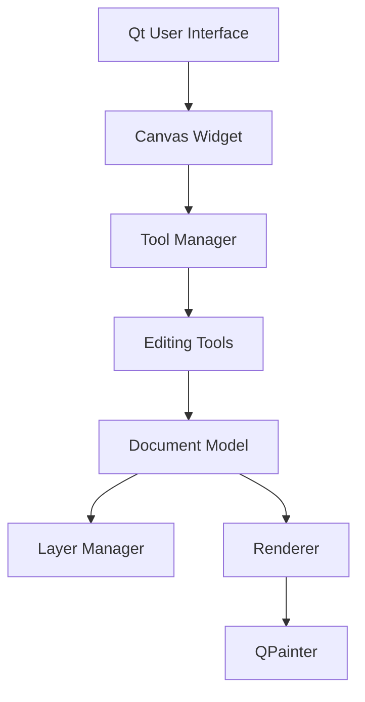
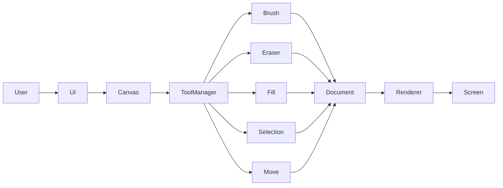
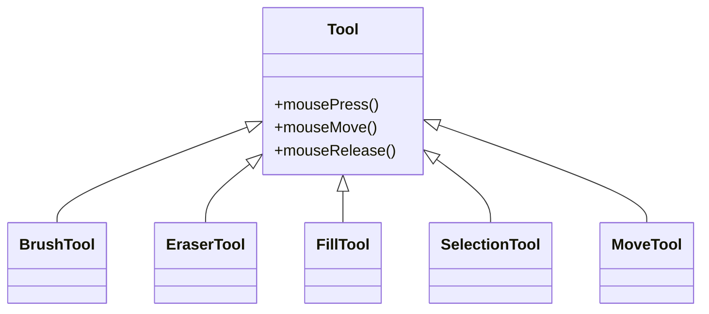
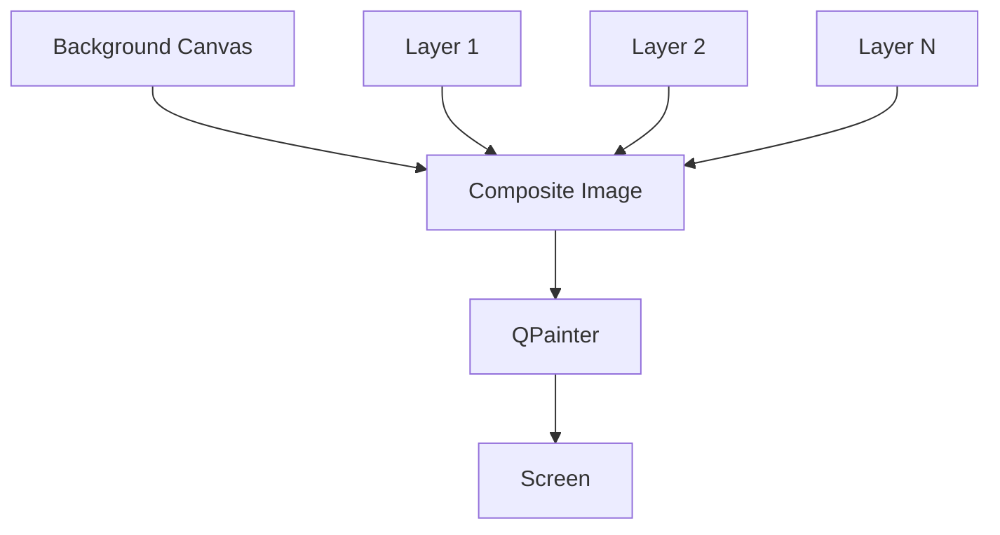
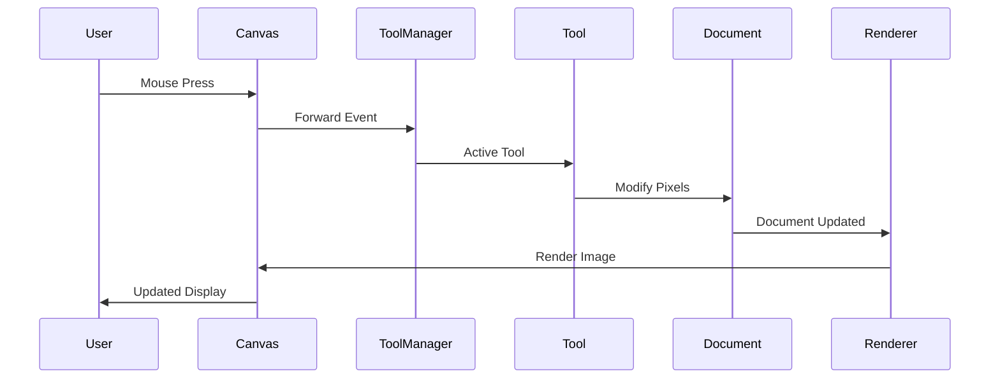

# Chithra

<p align="center">
  <b>A modern layer-based raster graphics editor built with C++ and Qt.</b><br>
  Designed with a modular architecture inspired by professional image editing software while maintaining simplicity, performance, and extensibility.
</p>

---

# Overview

Chithra is a desktop raster graphics editor developed using **C++** and **Qt 6**. The project emphasizes clean software architecture, modular design, and extensibility rather than being a simple drawing application.

The editor separates the **document model**, **rendering engine**, **tool system**, and **user interface** into independent components, making it easier to introduce new editing features without affecting existing functionality.

Current development focuses on building a scalable foundation before implementing advanced image editing capabilities.

---

# Key Features

### Drawing Engine

* Brush Tool
* Eraser Tool
* Flood Fill Tool
* Smooth mouse drawing
* Custom brush color

### Layer System

* Multiple editable layers
* Layer visibility
* Layer renaming
* Layer deletion
* Drag-and-drop layer ordering
* Active layer selection

### Rendering

* Real-time rendering
* Layer compositing
* Separate background canvas
* Incremental repainting

### User Interface

* Qt Widgets based interface
* Layer management panel
* Tool selection
* Canvas interaction

---

# Architecture Overview

Chithra follows a layered architecture that separates presentation, business logic, rendering, and document management.



Each layer communicates only with the components directly below it, reducing coupling and improving maintainability.

---

# High-Level System Design



The rendering engine is completely independent of the editing tools. Tools only modify the document model.

---

# Component Architecture

## 1. User Interface

Responsible for user interaction.

Responsibilities

* Main application window
* Toolbar
* Layer panel
* Canvas viewport
* Mouse input
* Keyboard shortcuts

Core Classes

```
MainWindow
CanvasWidget
LayerItemWidget
LayerListWidget
```

The UI never edits image pixels directly. Every editing operation passes through the Tool System.

---

## 2. Tool System

The Tool System encapsulates all editing operations.



Every tool is responsible only for its own editing logic.

This architecture allows additional tools to be introduced without modifying existing ones.

Examples include

* Shape Tool
* Crop Tool
* Gradient Tool
* Text Tool
* Clone Stamp

---

## 3. Document Model

The document stores the complete editing state.

```text
Document
│
├── Canvas (Background)
│
├── Layer 1
├── Layer 2
├── Layer 3
│
└── Active Layer
```

Unlike many editors, the background is intentionally **not treated as a layer**.

This design avoids unnecessary layer management complexity while allowing drawing directly on the background when no editable layer is selected.

The document is responsible for

* Canvas dimensions
* Layer collection
* Active layer
* Pixel storage
* Layer ordering

---

## 4. Layer Manager

The Layer Manager provides a controlled interface for manipulating document layers.

Responsibilities

* Add layers
* Remove layers
* Rename layers
* Change visibility
* Reorder layers
* Manage active layer

The Layer Manager does not perform rendering.

Instead, it provides the Renderer with the correct rendering order.

---

## 5. Rendering Engine

The Renderer converts document data into the final image displayed on screen.

Rendering pipeline



Future versions will introduce

* Alpha blending
* Layer opacity
* Blend modes
* GPU acceleration

without changing the editing tools.

---

# Event Flow

The following diagram illustrates the lifecycle of a drawing operation.



---

# Rendering Workflow

```text
Mouse Event

↓

Canvas Widget

↓

Tool Manager

↓

Active Tool

↓

Document Updated

↓

Renderer

↓

Composite Image

↓

QPainter

↓

Display
```

---

# Project Structure

```text
Chithra
│
├── src
│   ├── core
│   │   ├── Document
│   │   ├── Layer
│   │   ├── Image
│   │   └── Renderer
│   │
│   ├── tools
│   │   ├── Tool
│   │   ├── BrushTool
│   │   ├── EraserTool
│   │   ├── FillTool
│   │   ├── SelectionTool
│   │   ├── MoveTool
│   │   └── ToolManager
│   │
│   ├── ui
│   │   ├── MainWindow
│   │   ├── CanvasWidget
│   │   ├── LayerItemWidget
│   │   └── LayerListWidget
│   │
│   └── main.cpp
│
├── docs
│
├── resources
│
└── README.md
```

---

# Current Status

| Module              | Status         |
| ------------------- | -------------- |
| Brush Tool          | ✅ Complete     |
| Eraser Tool         | ✅ Complete     |
| Fill Tool           | ✅ Complete     |
| Layer System        | ✅ Complete     |
| Layer Management UI | ✅ Complete     |
| Rendering Engine    | ✅ Complete     |
| Selection Tool      | 🚧 In Progress |
| Move Tool           | 🚧 In Progress |
| Undo / Redo         | ⏳ Planned      |
| Shape Tools         | ⏳ Planned      |
| Crop Tool           | ⏳ Planned      |
| Transform Tool      | ⏳ Planned      |
| Text Tool           | ⏳ Planned      |
| Filters             | ⏳ Planned      |
| Zoom & Pan          | ⏳ Planned      |

---

# Planned Improvements

## Editing

* Selection Tool
* Move Tool
* Crop Tool
* Shape Tools
* Text Tool

## Rendering

* Layer opacity
* Blend modes
* GPU rendering
* Optimized redraw regions

## User Experience

* Undo / Redo
* Keyboard shortcuts
* Zoom and pan
* Export dialog
* Preferences

---

# Design Principles

The project is guided by the following engineering principles:

* Separation of concerns
* Modular architecture
* Single Responsibility Principle
* Extensible tool framework
* Maintainable codebase
* Low coupling between subsystems
* Clear ownership of document state

These principles ensure that future functionality can be added with minimal modification to existing components.

---

# Technology Stack

| Component    | Technology |
| ------------ | ---------- |
| Language     | C++17      |
| Framework    | Qt 6       |
| Rendering    | QPainter   |
| Build System | CMake      |
| UI           | Qt Widgets |

---

# Building

```bash
git clone https://github.com/<username>/Chithra.git

cd Chithra

mkdir build
cd build

cmake ..

cmake --build .
```

---

# License

This project is released under the MIT License.
